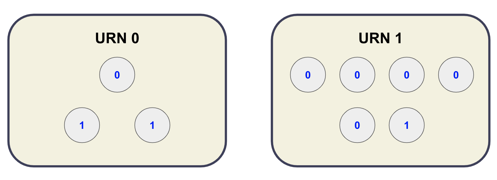

# Probability Assignment

## Question 1a
We have formula of Bernoulli distribution: $f(k;p) = p^{k} \times (1-p)^{1-k}$ for $k \in \{0,1\}$  
As given, $p=\frac{1}{2}$ so $f(k;\frac{1}{2}) = \frac{1}{2}^{k} \times \frac{1}{2}^{1-k} = \frac{1}{2}$ for $k \in \{0,1\}$  
Therefore, the probability of an employee approving and the probability of an employee disapproving are equal: $f(1;\frac{1}{2}) = f(0;\frac{1}{2}) = \frac{1}{2}$. 
Hence, the probability of 25 out of 50 employees approving: $$C^{25}_{50} \times f\left(1;\frac{1}{2}\right)^{25} \times f\left(0;\frac{1}{2}\right)^{50-25} = 0.112275$$

## Question 1b
We have $np = 50 \times \dfrac{1}{2}=25 \geqslant 5$ and $n(1-p) = 50 \times \dfrac{1}{2}=25 \geqslant 5$. Therefore, we approximate the Bernoulli distribution to Binomial distribution. 
The mean is $\mu = np = 50 \times \frac{1}{2} = 25$ 
The variance is $\sigma = \sqrt{np(1-p)} = \sqrt{50 \times \frac{1}{2} \times \frac{1}{2}} = \dfrac{5\sqrt{2}}{2}$ 
Hence, apply this [value table](https://drive.google.com/file/d/1ar-RkujnTzlR9xVkBiMw5CtFtu_VQnWb/view?usp=sharing) learned from course **Probability & Statistics MATH 333**, the probability of 25 out of 50 employees approving:
$$P(X = 25) = P(24.5 < X < 25.5) = P \left( \dfrac{24.5-25}{\frac{5\sqrt{2}}{2}} < X < \dfrac{25.5-25}{\frac{5\sqrt{2}}{2}}\right)=P(-0.14 < X < 0.14) =  P(X < 0.14) - P(X \leqslant - 0.14)$$
$$= 0.555760 - 0.444330 = 0.11143$$
*Compare to Question 1a, the two results are approximately equal.*

## Question 2
Sequence of the numbers: **0 $\rightarrow$ 0 $\rightarrow$ 1 $\rightarrow$ 1**.  
After the first ball 0 is drawn, the remaining process (**0 $\rightarrow$ 1 $\rightarrow$ 1**) is the same no matter whether it is initially drawn from Urn 0 or Urn 1.
 
- The probability of a H or a T outcome after flipping a fair coin is $\frac{1}{2}$.
    - The probability of drawing first ball 0 from Urn 0 is $\frac{1}{3}$. Then draw from Urn 0.
    - The probability of drawing first ball 0 from Urn 1 is $\frac{5}{6}$. Then draw from Urn 0.
- The probability of drawing ball 0 from Urn 0 is $\frac{1}{3}$. Continue to draw from Urn 0.
- The probability of drawing ball 1 from Urn 0 is $\frac{2}{3}$. Now draw from Urn 1.
- The probability of drawing ball 1 from Urn 1 is $\frac{1}{6}$.

Hence, the probability is $\dfrac{1}{2} \times \left(\dfrac{1}{3} + \dfrac{5}{6}\right) \times \dfrac{1}{3} \times \dfrac{2}{3} \times \dfrac{1}{6} =\dfrac{7}{324} = 0.0216$.

## Question 3
I use [Google Colab](Probability_Assignment_Question_3.ipynb) to plot. 

## Question 4
I use [Google Colab](Probability_Assignment_Question_4.ipynb) to plot. 

## Question 5
I use [Google Colab](Probability_Assignment_Question_5.ipynb) to plot. 
